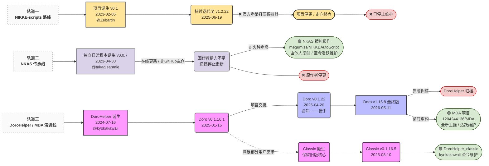

<!-- markdownlint-disable MD033 MD041 -->

# DoroHelper-AI

PC 端日常任务清理助手。一键清理多项日常事务。支持除**国服**外的所有客户端。

> **注意：** 本项目是基于 [DoroHelper](https://github.com/1204244136/DoroHelper)（原作者 [@1204244136](https://github.com/1204244136)）的二次开发版本，采用 AI 辅助维护。保留原 AGPL-3.0 许可证。

  
  
  
   
  
  
  

**[English Readme](README_en.md) | 中文说明**

## DoroHelper 已全面升级为 MDA

非常感谢大家一直以来对 DoroHelper 的支持与陪伴。

在持续开发与维护的过程中，当前脚本的整体架构已经较为老旧，限制了后续功能扩展与长期维护的效率。因此，基于全新的 MaaFramework 框架，脚本已完成完整重写。新版脚本命名为 **MDA（Maa Doro Assistant）**。借助这一成熟且强大的社区工具，未来在修复问题与更新内容方面将更加高效、稳定。

相比旧版本，新框架带来了一系列显著提升：

- 全新 UI 设计，界面更加简洁美观，并原生支持多语言，可自由设置主题、配色与背景
- 支持任务顺序自由调整，并提供更加丰富的细节配置选项
- 支持游戏后台运行，使用体验更加灵活
- 支持全分辨率运行，不再受限于特定分辨率
- 支持 Linux、macOS 等操作系统，并兼容 aarch64 架构

### MDA 下载地址

|渠道|链接|
|--|--|
|GitHub|[https://github.com/1204244136/MDA/releases/latest](https://github.com/1204244136/MDA/releases/latest)|
|百度网盘|[https://pan.baidu.com/s/1X4_vJ3ei9fiayRWHpI0f9A?pwd=bed7](https://pan.baidu.com/s/1X4_vJ3ei9fiayRWHpI0f9A?pwd=bed7)（提取码：bed7）|
|夸克网盘|[https://pan.quark.cn/s/9a30ca1aabe7](https://pan.quark.cn/s/9a30ca1aabe7)（提取码：Cprn）|

旧版本将停止维护但仍可正常使用。如果新版本未能符合你的使用习惯，也欢迎继续选择旧版本。

## 项目演进历史

## 版本问题

下方的功能介绍均针对最新版本，老版本的对应功能请查看[legacy-v0.1.22](https://github.com/1204244136/DoroHelper/tree/legacy-v0.1.22)分支处的自述文件。
老版本已停止维护！

**⚠️ 为了各自生活的便利，请不要在公开场合发布本软件国服相关的修改版本，谢谢配合！**

## 免责声明

本项目仅供个人学习研究使用，严禁用于商业用途。除 Github 和下方 qq 群以外其他任何网站、社交平台中有关本项目的内容**均非本人发布**，若造成侵犯著作权、版权或违反网络安全法规等任何后果，均与本人无关。

使用任何脚本程序均有封号风险，请谨慎。

程序可能会有操作不兼容的情况出现。第一次使用最好在旁边看着。万一 Doro 失控，请按 Ctrl + 1 组合键结束进程或者 Ctrl + 2 组合键暂停进程。

## 使用

### 运行仓库内的 ahk 文件（推荐）

1. 将整个项目文件下载到本地并解压（右上角绿色 code 按钮-Download ZIP）
1. 下载并安装[AutoHotkey V2.0](https://www.autohotkey.com/download/ahk-v2.exe)（不要修改默认安装路径）
1. 以管理员身份运行 DoroHelper.ahk

### 运行发行版的 exe 文件

1. 下载右边的 release 文件
1. 以管理员身份运行 DoroHelper.exe

## 功能介绍

Doro 只是想让你少被该死的读条、闪光弹和重复劳动折磨。一键清理多项日常事务（按顺序执行且均可选），包括：

- **付费商店**
  - 领取免费珠宝
  - 领取免费礼包

- **普通商店**
  - 每天白嫖 2 次
  - 用信用点买芯尘盒
  - 购买简介个性化礼包

- **竞技场商店**
  - 购买指定类型的属性技能书
  - 购买代码手册宝箱
  - 购买简介个性化礼包
  - 购买公司武器熔炉

- **模拟室**
  - 普通模拟室（需解锁快速模拟）
  - 模拟室超频

- **竞技场**
  - 竞技场收菜
  - 新人竞技场
  - 特殊竞技场
  - 冠军竞技场

- **无限之塔**
  - 爬企业塔
  - 爬通用塔

- **拦截战**
  - 普通拦截
  - 异常拦截

- **常规奖励领取**
  - 前哨基地收菜
    - 进行派遣
  - 好感度咨询
    - 花絮鉴赏
  - 好友点数收取
  - 邮箱收取
  - 任务收取
  - 通行证收取
  - 协同作战
  - 单人突击日常

- **限时奖励领取**
  - 活动期间每日免费招募

- **妙妙工具**
  - 剧情模式（解放双手自动看剧情，自动点击选项）
  - 调试模式（直接运行指定函数）
  - 极速爆裂模式（秒开爆裂，比自动更快，解放双手）
  - 推图模式（自动打主线关卡）

## 步骤

打开 NIKKE 启动器。点击启动。等 NIKKE 主程序中央 SHIFT UP logo 出现之后，再切出来点击“DORO!”按钮。如果你看到鼠标开始在左下角连点，那就代表启动成功了。然后就可以悠闲地去泡一杯咖啡，或者刷一会儿手机，等待 Doro 完成工作了。

也可以在游戏处在大厅界面时（有看板娘的页面）切出来点击“DORO!”按钮启动程序。

## 反馈和改进

加入[DoroHelper 反馈群](https://qm.qq.com/q/f0Q1yr7vzi)

加入[Discord](https://discord.gg/f4rAWJVNJj)

## 支持和鼓励

知一一：前任作者[牢 H](https://github.com/kyokakawaii) 停更后，DoroHelper 的绝大部分维护和新功能的添加都是我在做，这耗费了我大量时间和精力，希望有条件的小伙伴们能支持一下

### 国内

<table>
  <tr>

  </tr>
</table>

### 国外(global)

<table>
  <tr>

  </tr>
</table>

以下为支持的平台：

Hanpass|PandaRemit|WireBarley|GmoneyTrans|Debunk|PayForex|koala transfer|Sendly|GME

## 星标历程

## 借物表

[Github.ahk-API-for-AHKv2](https://github.com/samfisherirl/Github.ahk-API-for-AHKv2)

[FindText-for-AHKv2](https://www.autohotkey.com/boards/viewtopic.php?f=83&t=116471)

## 鸣谢

代码参考

[M9A](https://github.com/MAA1999/M9A)
