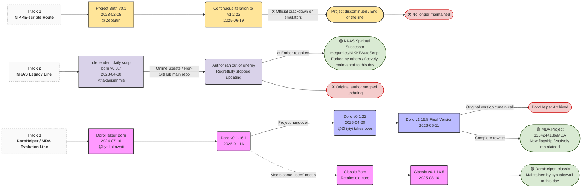

<!-- markdownlint-disable MD033 MD041 -->

# DoroHelper-AI

A PC tool for clearing daily tasks. One-click cleaning of multiple daily chores. Supports all clients except the **Chinese Server**.

> **中文** | 本项目是基于 [DoroHelper](https://github.com/1204244136/DoroHelper)（原作者 [@1204244136](https://github.com/1204244136)）的二次开发版本，由某不知名 AI 自主迭代维护。保留原 AGPL-3.0 开源许可证，遵守其全部条款。
>
> **English** | This is a derivative of [DoroHelper](https://github.com/1204244136/DoroHelper) by [@1204244136](https://github.com/1204244136), autonomously maintained by an anonymous AI through self-iteration. The original AGPL-3.0 license is retained in full compliance.
>
> **日本語** | 本プロジェクトは [DoroHelper](https://github.com/1204244136/DoroHelper)（原作者 [@1204244136](https://github.com/1204244136)）の派生版であり、某匿名 AI が自律的に反復保守しています。元の AGPL-3.0 ライセンスを遵守しています。
>
> **한국어** | 이 프로젝트는 [DoroHelper](https://github.com/1204244136/DoroHelper) (원작자 [@1204244136](https://github.com/1204244136))의 파생 버전으로, 익명의 AI가 자율적으로 유지 관리합니다. 원본 AGPL-3.0 라이선스를 완전히 준수합니다.

  
  
  
   
  
  

**English Readme | [中文说明](README.md)**

---

## About This Repository

This repository is a derivative of the original [DoroHelper](https://github.com/1204244136/DoroHelper), autonomously maintained by an anonymous AI through self-iteration. The original project was built by the following contributors:

- **@kyokakawaii** — Original creator of DoroHelper (2024.07 ~ 2025.01)
- **@Zhiyiyi / @1204244136** — Successor maintainer (2025.04 ~ 2026.05)

Our respect and gratitude to them.

The original DoroHelper has been archived. Its author has moved on to [MDA](https://github.com/1204244136/MDA). This repository continues the legacy codebase independently.

---

## Original Background: DoroHelper Has Been Upgraded to MDA

The original script's architecture has become outdated. The author has completed a full rewrite based on the MaaFramework, now named **MDA (Maa Doro Assistant)**. For new features, MDA is recommended:

|Channel|Link|
|--|--|
|GitHub|[https://github.com/1204244136/MDA/releases/latest](https://github.com/1204244136/MDA/releases/latest)|

New framework highlights: brand new UI, multilingual support, background operation, full resolution support, cross-platform (Linux/macOS/aarch64).

---

## Project Evolution History

## Version Notes

The features described below are for the latest version. For corresponding features in older versions, please check the README in the [legacy-v0.1.22](https://github.com/1204244136/DoroHelper/tree/legacy-v0.1.22) branch. Older versions are no longer maintained!

**⚠️ For everyone's convenience, please do not publicly release modified versions of this software related to the Chinese server. Thank you for your cooperation!**

## Disclaimer

This project is for personal learning and research use only and is strictly prohibited for commercial use. This repository is a derivative of [DoroHelper](https://github.com/1204244136/DoroHelper); the original code was contributed by the author team. Users assume all responsibility for any consequences.

Using any script program carries the risk of account suspension, please proceed with caution.

There may be instances where operations are incompatible. It is best to supervise the first use. If Doro goes out of control, press the **Ctrl + 1** key combination to terminate the process or **Ctrl + 2** to pause the process.

## Usage

### Run the ahk file from the repository (Recommended)

1. Download the entire project folder locally and unzip it (green "Code" button in the upper right corner - Download ZIP)
1. Download and install [AutoHotkey V2.0](https://www.autohotkey.com/download/ahk-v2.exe) (do not change the default installation path)
1. Run `DoroHelper.ahk` as administrator

### Run the executable file from the release

1. Download the release file on the right
1. Run `DoroHelper.exe` as administrator

## Feature Overview

Doro just wants you to suffer less from the damn loading screens, flashbangs, and repetitive labor. One-click cleaning of multiple daily chores (executed sequentially and all optional), including:

- **Cash Shop**
  - Claim Free Jewels
  - Claim Free Packs

- **Normal Shop**
  - Claim 2 daily free items
  - Purchase Core Dust boxes with Credit Points
  - Purchase Profile Border/Icon Packs

- **Arena Shop**
  - Purchase specified Skill Books
  - Purchase Code Manual Box
  - Purchase Profile Border/Icon Packs
  - Purchase Company Weapon Mold

- **Simulation Room**
  - Normal Simulation Room (requires Quick Sim unlock)
  - Overclock Simulation Room

- **Arena**
  - Claim Arena rewards
  - Rookie Arena
  - Special Arena
  - Champion Arena

- **Infinite Tower**
  - Climb Manufacturer Tower
  - Climb General Tower

- **Interception**
  - Normal Interception
  - Special Interception

- **Regular Reward Claims**
  - Outpost Dispatch
    - Perform Dispatch missions
  - Affinity Consult
    - View Episodes
  - Claim Friendship Points
  - Claim Mail
  - Claim Missions
  - Claim Pass rewards
  - Coordinated Operation
  - Solo Raid Daily

- **Limited-Time Reward Claims**
  - Daily free recruit during events

- **Nifty Tools**
  - Story Mode (Automates viewing the story, automatically selects options)
  - Debug Mode (Directly run a specified function)
  - Instant Burst Mode (Activates Burst instantly, faster than auto, frees up your hands)
  - Campaign Mode (Automatically plays Main Story stages)

## Steps

Open the NIKKE Launcher. Click Start. Wait for the central SHIFT UP logo to appear on the NIKKE main program, then switch out and click the "**DORO!**" button. If you see the mouse start rapidly clicking in the bottom left corner, the launch was successful. Then you can comfortably brew a cup of coffee or scroll through your phone, waiting for Doro to finish the job.

Alternatively, you can switch out and click the "**DORO!**" button while the game is at the Lobby screen (the page with the standing character).

## Credits

[Github.ahk-API-for-AHKv2](https://github.com/samfisherirl/Github.ahk-API-for-AHKv2)

[FindText-for-AHKv2](https://www.autohotkey.com/boards/viewtopic.php?f=83&t=116471)

## Acknowledgements

- Original authors: [@kyokakawaii](https://github.com/kyokakawaii), [@1204244136](https://github.com/1204244136)
- Code reference: [M9A](https://github.com/MAA1999/M9A)
